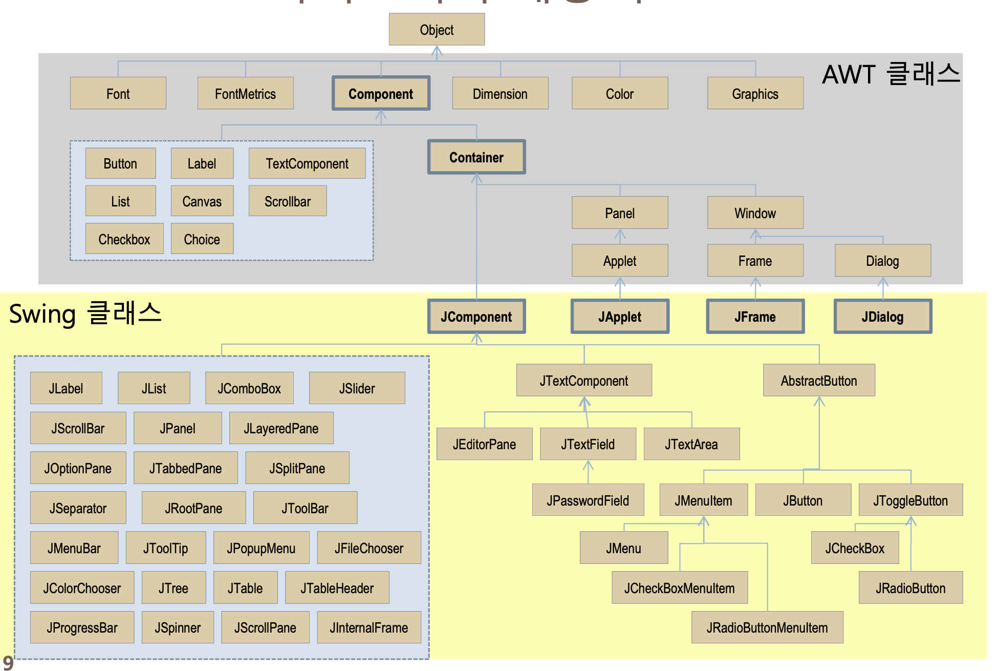

# JAVA.AWT
- java.awt : AWT를 이용한 GUI어플리케이션 작성에 필요한 기본적 클래스와 컴포넌트 제공.
- java.awt.event : GUI어플리케이션에서 발생하는 이벤트를 처리하는데 필요한 클래스,인터페이스 제공.
- java.awt.datatransfer : 어플리케이션 내/어플리케이션 간 데이터 전송 구현에 필요한 클래스, 인터페이스 제공.
- java.awt.dnd : 끌어놓기=드래그 앤 드롭(Drag and Drop) 구현에 필요한 클래스 제공.
- java.awt.font : 폰트와 관련된 클래스,인터페이스를 제공.
- java.awt.image : 이미지 생성, 변경에 사용되는 클래스 제공.
- java.awt.print : 출력에 관련된 클래스와 인터페이스 제공.
# Javax.swing
- javax.swing : awt의 확장판
 

---

# JAVA.AWT 
## Component
구조,표현적 인터페이스
## Container
## Frame
## Panel
## Button
## Choice
## List
## Container.Label
## Checkbox, CheckboxGroup
## TextField
## TextArea
## Canvas
## Panel
## Scrollbar:
볼륨 설정, 속도 조절, 색상 선택 등
## ScrollPane: 스크롤바
## Font
## Color
## Dialog 메세지창
## FileDialog
## Layout Manager
## MenuComponent


---
## Component
GUI 프로그램에서 사용하는 구조적 인터페이스.2가지로 나뉨
### 일반 컴포넌트
- Button, Label, Checkbox, List, Choice, Scrollbar, Dialog(대화상자요소), Frame, TextArea/TextField, FileDialog(파일열기)..
### 메뉴 컴포넌트
- MenuBar, MenuItem(Menu-PopupMenu, CheckboxMenuItem) ..
### 메서드
- Color getBackground() : 컴포넌트의 배경색을 얻는다
- void setBackground(Color c) : 컴포넌트의 배경색을 지정된 색으로 변경한다.
- Cursor getCursor() : 컴포넌트에 지정된 커서를 얻는다.
- void setCursor(Cursor c) : 컴포넌트의 커서(마우스포인터) 를 지정한다.
- Font getFont() : 컴포넌트에 지정되어 있는 Font를 얻는다.
- void setFont(Font f) : 컴포넌트의 Font를 지정한다.
- Color getForeground() : 컴포넌트의 전경색을 얻는다.
- void setForeground(Color c) : 컴포넌트의 전경색을 지정한다.
- int getHeight() : 컴포넌트의 높이를 얻는다.
- int getWidth() : 컴포넌트의 폭을 얻는다.
- void setBounds(int x, int y, int witdh, int height) : 컴포넌트의 위치(x,y)와 크기(width, height)를 지정한다.
- Rectangle getBounds() : 컴포넌트의 위치와 크기(Rectangle 객체)를 얻는다.
- Point getLocation() : 컴포넌트의 위치를 얻는다.
- void setLocation(int x, int y) : 컴포넌트의 위치를 지정한다.
- Dimension getSize() : 컴포넌트의 크기를 얻는다.
- void setSize(int width, int height) : 컴포넌트의 크기를 지정한다.
- boolean hasFocus() : 컴포넌트가 현재 focus를 갖고 있는지 알려준다.
- void requestFocus() : 컴포넌트가 focus를 갖도록 한다.
- void paint(Graphics g) : 컴포넌트를 화면에 그린다.
- void repaint() : 컴포넌트를 화면에 다시 그린다.
- void setEnabled(boolean b) : 컴포넌트를 사용가능(true)/불가능(false)하게 한다.
- Container getParent() : 컴포넌트가 포함되어져 있는 컨테이너(parent)를 얻는다.
- void setVisible(boolean b) : 컴포넌트가 화면에 보이게(true)/보이지 않게(false)한다.

---

## Container(Container)
한 컨테이너 안에 다른 컨테이너,컴포넌트를 포함할 수 있다. 2가지로 나뉨.
### 독립적 컨테이너.
다른 컨테이너에 종속(포함)안되도 됨
  - Frame
  - Window
  - Dialog
### 종속적 컨테이너.
다른 컨테이너에 종속(포함)되어야만 함
  - Panel
  - ScrollPane(스크롤페인)
### 메서드
- Component[] getComponents() : 컨테이너에 포함되어 있는 모든 컴포넌트를 얻는다.
- Component getComponent(int n) : 컨테이너에 n번쨰로 추가된 컴포넌트를 얻는다.
- Component getComponentAt(int x, int y) : 컨테이너의 지정 위치(x, y)에 있는 컴포넌트를 얻는다.
- Component add(Component comp) : 컨테이너에 컴포넌트를 추가한다.
- void remove(Component comp) : 컨테이너에서 지정된 컴포넌트를 제거한다.
- Insets getInsets() : 컨테이너의 경계의 크기를 알 수 있는 Inset객체를 얻는다.
- LayoutManager getLayout() : 컨테이너에 설정되어 있는 LayoutManager를 얻는다.
- void setLayout(LayoutManager mgr) : 컨테이너에 LayoutManager를 설정한다.

---


## Frame(Container)
Window와 모양이 같다. 컴포넌트들을 포함할 수 있는 일반적인 컨테이너.
titlebar, 최대화버튼, 최소화버튼, 닫기버튼 있음.
근데 닫기 버튼은 이벤트처리 따로 추가 설정 해줘야 작동함.

### 메서드
- Frame(String title) : Frame을 생성한다.
- title은 Frame의 titlebar에 보여질 text를 말한다(필수)
- String getTitle() : titlebar에 있는 text를 얻는다.
- void setTitle(String title) : titlebar의 text를 변경한다.
- void setState(int state) : Frame의 상태를 변경할 수 있다.
  - state에는 두 가지 값 중 하나를 사용할 수 있다.
    - Frame.ICONIFIED : Frame을 최소화 상태가 되게 한다.
    - Frame.NORMAL : Frame을 정상상태(최소화 이전 상태)가 되게 한다.
- int getState() : Frame의 현재 상태를 알 수 있다.
- void setResizable(boolean resizable) : Frame의 크기를 변경가능(true)/불가능(false) 하게 한다.
  - false일 때는 사용자가 Frame의 크기를 변경할 수 없다.

## Panel(Container)
- 컴포넌트 등을 담는 평면 공간(컨테이너)
> 1. 단독사용 불가함 (종속적)
> 2. titleBar,button 같은게 없음.(순수한 컨테이너임)
> 3. 컨테이너니까 자신만의 layout 유지 가능. 즉,컴포넌트 배치가 자유로움.
 
```java
import java.awt.*;

public class PanelTest {
    public static void main(String[] args) {
        Frame f = new Frame("Panel");
        f.setSize(300,200);
        f.setLayout(null); // Frame이 LayoutManager를 사용하지 않게 한다.

        Panel p = new Panel(); // Panel은 LayoutManager를 사용 - Panel안의 버튼 위치,크기는 자동배치.
        p.setBackground(Color.green);
        p.setSize(100, 100);
        p.setLocation(50, 50);

        Button ok = new Button("OK");

        p.add(ok); // Button은 Panel에 포함시킨다.
        f.add(p); // Panel은 Frame에 포함시킨다.
        f.setVisible(true);

    }
}
```


## Button
 사용자가 클릭했을 때 어떤 작업이 수행되도록 함.
- Button(String label) : 지정된 label을 가진 Button을 생성한다.
- label : Button위에 나타날 text를 말한다.
- String getLabel() : Button에 나타나 있는 text를 얻는다.
- void setLabel(String label) : Button에 나타나 있는 text를 변경한다.
>레이아웃매니저를 해제하고 직접 버튼 크기와 위치를 설정할 수 있음

## Choice,List
### Choice
item 목록을 보여줌.ComboBox,drop-down listbox 지원.

> nav나 menu 같은거에 씀.
### List
item 목록 나열. 초이스와 다르게 MultipleMode 로 다중선택 지원.

> 설문 기능 같은거 만들때 씀.
### Choice 메서드
- void add(String item) : Choice에 item을 추가한다.
- void remove(String item) : Choice에서 item을 제거한다.
- void remove(int index) : 지정된 인덱스의 item을 제거한다.
- AWT에서도 index는 0번째부터 시작한다! 첫 번째 item의 인덱스 = 0.
- void removeAll() : Choice의 모든 item을 제거한다.
- void insert(String item, int index) : 지정된 인덱스에 item을 추가한다.
- String getItem(int index) : 지정된 인덱스의 item을 얻는다.
- int getItemCount() : 현재 Choice에 추가되어 있는 item이 몇 개인지 알려준다.
- int getSelectedIndex() : 현재 선택되어져 있는 item의 index값을 얻는다.
- String getSelectedItem() : 현재 선택되어져 있는 item을 얻는다.
### List 메서드
- List(int rows, boolean multipleMode). {rows (기본값:4), multipleMode (기본값:false)}
- void add(String item) : item을 List에 추가한다.
- void add(String item, int index) : 지정 인덱스에 item을 추가한다.
- void replaceItem(String newValue, int index) : 지정 인덱스의 item을 newValue로 바꾼다.
- void remove(String item) : List에서 해당 item 제거
- void remove(int index) : 지정 인덱스의 item 제거
- void removeAll() : List의 모든 item 제거
- int getRows() : List에 스크롤 없이 볼 수 있는 아이템의 수를 얻는다.
- int getItemCount() : List에 있는 item이 모두 몇 개인지 알려준다.
- String getItem(int index) : 지정 인덱스의 item을 얻는다.
- String[] getItems() : List의 모든 item을 얻는다.
- void select(int index) : 지정 인덱스의 item을 선택한다.
- void deselect(int index) : 지정 인덱스의 item을 선택해제한다.
- int getSelectedIndex() : 현재 선택된 item의 인덱스를 얻는다.
- int[] getSelectedIndexes() : 현재 선택된 item들의 인덱스를 모두 얻는다.
- multipleMode가 true인 경우 사용 가능.
- String getSelectedItem() : 현재 선택된 item을 얻는다.
- String[] getSelectedItems() : 현재 선택된 item들을 얻는다.(multipleMode가 true인 경우 사용 가능.)
- boolean isIndexSelected(int index) : 지정 인덱스의 item이 선택되어있는지 알려준다.
- void setMultipleMode(boolean b) : List를 multipleMode로 할 것인지 설정.


## Label
Text 표시.
>설명이나 메시지 같은거 보여줄때 씀.

### 메서드
- Label(String text, int alignment) text=글, alignment=글 정렬(기본값:LEFT)
  - Label.LEFT,CENTER,RIGHT
- String getText() : Label의 text를 얻어온다
- void setText(String text) : Label의 text를 주어진 값으로 변경
- void setAlignment(int alignment) : Label의 text정렬을 지정 
 
Frame에 레이아웃매니저가 설정안됐거나, 컴포넌트들의 크기를 지정하지 않으면 안보임.

.setSize() 또는 .setBounds()를 통해 컴포넌트 크기를 지정해야 한다.
## Checkbox, CheckboxGroup
### Checkbox 
boolean처럼 true/false(또는 on/off) 중 하나의 값을 가질 수 있는 컴포넌트이다.
CheckboxGroup 으로 그룹화하지 않으면 모든 값을 중복선택 가능.
### CheckboxGroup 
여러 값들 중 하나를 선택하는 radio button 지원.
같은 그룹 내 Checkbox중에서 한 가지만 선택가능.
### 메서드
- Checkbox(String text,CheckboxGroup group, boolean state) : Checkbox 객체 생성 
  - test : Checkbox와 함께 표시될 text
  - state : 체크상태 (true:false ? on/off) 기본값은 false다
  - group : radio 버튼
- String getLabel() : Checkbox의 label을 얻는다
- void setLabel(String label) : Checkbox의 label을 주어진 값으로 변경한다.
- boolean getState() : Checkbox의 상태를 얻는다. true이면 체크된 상태.
- void setState(boolean state) : Checkbox의 상태를 설정. state를 true로 하면 Checkbox가 체크된 상태가 된다.
## TextField
사용자로부터 값(_주로 'name','id','pw'_)을 입력 받을 component. 편집이 가능하고 한줄만 입력 가능.
### 메서드
- TextField(String text, int col) : TextField 객체 생성
    - text : 보여질 text 지정
    - col : 입력받을 글자수,혹은 크기
- void setEchoChar(char c)  : 비밀번호 입력용. c에 따로 값 지정해줘야됨 '***' 같은거 
- int getColumns() : TextField의 col 수를 얻는다
- void setText(String t) : TextField의 text를 t로 한다.
- String getText() : TextField의 text를 얻는다.
- void select(int selectionStart, int selectionEnd) : selectionStart~selectionEnd까지의 text를 선택(하이라이트).
- void selectAll() : TextField의 모든 text를 선택된 상태로 만든다.
- String getSelectedText() : TextField의 text중 선택된 부분을 얻는다.
- void setEditable(boolean b) : TextField의 text를 편집가능(true)/불가능(false)하게 설정.
## TextArea
편집가능하고 여러 줄의 text를 입력하거나 보여줄 수 있음.

지정된 col 초과시 스크롤바 자동생성.
- TextArea(String text, int row, int col, int scrollbar)
  - text : 보여질 텍스트
  - row : 행 수 (필수) 
  - col : 열 수 (필수)
  

  - scrollbar :  scrollbar의 종류 및 사용여부
  > TextArea.SCROLLBARS_BOTH
  > 
  > TextArea.SCROLLBARS_NONE
  > 
  > TextArea.SCROLLBARS_HORIZONTAL_ONLY
  > 
  > TextArea.SCROLLBARS_VERTICAL_ONLY

- int getRows(), int getColumns() : 행, 열 개수 얻기
- void setRows(int rows), void setColumns(int columns) : 지정 값으로 행, 열 개수 설정
- void append(String str) : text 맨 마지막에 str 덧붙이기
- void insert(String str, int pos) : text 의 지정위치 pos에 str을 넣기
- void replaceRange(String str, int start, int end)
- void setText(String t), String getText()
- void select(int selectionStart, int selectionEnd), void selectAll()
- String getSelectedText()
- void setEditable(boolean b)

## Canvas
빈 평면 공간. 그림그리기,이미지삽입,사용자정의 컴포넌트(div같은)
```java
import java.awt.*;

public class CanvasTest {
    public static void main(String[] args) {
        Frame f = new Frame("CanvasTest");
        f.setSize(100, 100);
        f.setLayout(null); // Frame의 LayoutManager 설정 해제

        Canvas c = new Canvas();
        c.setBackground(Color.pink); // 캔버스 배경 = 분홍색
        c.setBounds(50, 50, 150, 100); // 위치(x축/y축), 너비, 높이

        f.add(c);
        f.setVisible(true);
    }
}

```

## Scrollbar:

볼륨 설정, 속도 조절, 색상 선택 등

## ScrollPane(Container)
한개의 Component 만 포함 가능하고 포함된 Component 가 자신보다 크면 스크롤바 생김. 

>제한된 공간에서 크기가 큰 컴포넌트를 화면에 보여줄 때 씀
 
### 메서드
- ScrollPane(int scrollbarDisplayPolicy)
  - scrollbarDisplayPolicy : 스크롤바 표시 여부. {설정 안해도 생성 가능}
    > 1. SCROLLBARS_ALWAYS
    > 2. SCROLLBARS_AS_NEEDED
    > 3. SCROLLBARS,NEVER
```java
import java.awt.*;

public class ScrollPaneTest {
    public static void main(String[] args) {
        Frame f = new Frame("ScrollPaneTest");
        f.setSize(300, 200);

        ScrollPane sp = new ScrollPane();
        Panel p = new Panel();
        p.setBackground(Color.green);
        p.add(new Button("첫번째")); // Button들을 Panel에 포함시킨다.
        p.add(new Button("두번째"));
        p.add(new Button("세번째"));
        p.add(new Button("네번쨰"));

        sp.add(p); // Panel을 ScrollPane에 포함시킨다
        f.add(sp); // ScrollPane을 Frame에 포함시킨다
        f.setVisible(true);
    }
}
```

### ScrollPane: 스크롤바
- ScrollPan
- scrollbarDisplayPolicy()-아래 값 중 하나를 지정(스크롤바 표시 여부)
    - SCROLLBARS_ALWAYS, SCROLLBARS_AS_NEEDED, SCROLLBARS,NEVER


### Dialog(Container)
 종속적 컨테이너. 메세지창 띄울 때 씀.(에러발생,파일 삭제 전 확인 등)

- Dialog(Frame parent, String title, boolean modal)(생성자)
    - parent : (필수) 어떤 Frame에 속한 것인지 지정해줘야됨.
    - title : (필수) Dialog의 titlebar에 나타날 text 지정.
    - modal : Dialog를 modal(필수응답)으로 할건지 지정{기본값:false}
      - true : 부모 Frame의 Dialog가 사라지기 전까지는 사용할 수 없게 된다.(사용자에게 중요한 확인을 받아야 할 경우에 씀.)
      - false: Dialog가 열려있어도 부모 Frame을 사용할 수 있다.
- void show(), void hide() -> void setVisible(boolean b): Dialog 보이기/숨기기
- void dispose() : Dialog 삭제(화면에 안 보이게 한 후, 메모리에서 제거)
- String getTitle() : Dialog의 타이틀 get
- void setModal(boolean b) : Dialog의 modal에 입력값 설정해줌
- void setResizable(boolean resizable) : Dialog크기변경 가능/불가능 {기본값:false}
```java
import java.awt.*;

public class DialogTest {
    public static void main(String[] args) {
        Frame f = new Frame("Parent");
        f.setSize(300, 200);

        // parent Frame을 f, modal을 true(필수응답 Dialog)
        Dialog info = new Dialog(f, "Information", true);
        info.setSize(140, 90);
        info.setLocation(50,50); // parent Frame이 아닌, 화면이 위치기준이 됨.
        info.setLayout(new FlowLayout());
        // Dialog의 기본 레아이웃 매니저는 BorderLayout이기 떄문에 FlowLayout로 변경.

        Label msg = new Label("This is modal Dialog", Label.CENTER);
        Button ok = new Button("ok");
// 아직 안 배운 내용(이벤트 처리) - ok버튼 누르면 Dialog 창 없애기.
        ok.addActionListener(new ActionListener() {
            @Override
            public void actionPerformed(ActionEvent e) {
                //ok버튼을 누르면 수행될 메서드 : Dialog 없애기.
                info.setVisible(false); // Dialog를 안 보이게 한다.(숨김)
                info.dispose(); // Dialog를 메모리에서 없앤다.(삭제)
                // 둘 중 어느 방법을 사용해도 Dialog는 보이지 않게 되며, 부모Frame은 사용가능해진다.
            }
        });

        info.add(msg);
        info.add(ok);

        f.setVisible(true); // Frame을 보이게 한 다음,
        info.setVisible(true); // Dialog를 보이게 한다.
    }
}
```
## FileDialog
파일 (저장,열기) Dialog
- FileDialog(Frame parent, String title, int mode) (생성자)
    - parent : (필수) 어떤 Frame에 속한 것인지 지정
    - title : (필수) FileDialog의 titlebar에 보여줄 text 지정
    - mode : FileDialog.LOAD(열기), FileDialog.SAVE(저장) 중 하나 선택
- String getFile() : FileDialog에 의해 선택된 파일의 이름을 얻는다.
- String getDirectory() : FileDialog에 의해 선택된 파일의 경로(path)를 얻는다.
- void setFile(String file) FileDialog에 지정된 파일 설정
- void setDirectory(String dir) FileDialog에 지정된 폴더 설정

## Font
Font 인스턴스를 생성하고 컴포넌트의 글씨체를 지정
- Font(String name, int style, int size)
    - name : 사용할 폰트의 이름.
        > 기본 제공 폰트 : Serif, SansSerif, Dialog, DialogInput, Monospaced
         다른 폰트 사용을 위해서는 그 폰트가 컴퓨터에 설치되어 있어야 한다.
         현재 설치된 Font리스트 얻기 : GraphicsEnvironment 클래스의 메서드들을 이용한다.
    - style : 폰트 스타일 설정.
        > 1. Font.PLAIN
        > 2. Font.BOLD
        > 3. Font.ITALIC
        > 4. Font.BOLD+Font.ITALIC
    -  size : 폰트 크기 설정.
### Font 조회하기
```java
import java.awt.*;

public class FontList {
    public static void main(String[] args) {
        GraphicsEnvironment ge = null; // GraphicsEnvironment객체생성
        ge = GraphicsEnvironment.getLocalGraphicsEnvironment();
        Font[] fonts = ge.getAllFonts(); // 시스템 내의 폰트 목록 가져오기

        for(int i=0; i < fonts.length; i++) {
            System.out.println(fonts[i].getFontName()); // 폰트 이름 하나씩 출력
        }
    }
}
```

### Font 사용하기
```java
import java.awt.*;

public class FontTest {
    public static void main(String[] args) {
        Frame f = new Frame("Font Test");
        String abc = "ABCDEFGHIJKLMNOPQRSTUVWXYZ";

        Label abc1 = new Label(abc);
        Label abc2 = new Label(abc);
        Label abc3 = new Label(abc);
        Label abc4 = new Label(abc);
        Label abc5 = new Label(abc);

        // Font를 설정
        Font f1 = new Font("Serif", Font.PLAIN, 20); // 보통체
        Font f2 = new Font("Serif", Font.ITALIC, 20); // 기울임체
        Font f3 = new Font("Serif", Font.BOLD, 20); // 굵은체
        Font f4 = new Font("Serif", Font.BOLD+Font.ITALIC, 20); // 굵은 기울임체

        // 설정한 Font를 Label에 적용
        abc1.setFont(f1);
        abc2.setFont(f2);
        abc3.setFont(f3);
        abc4.setFont(f4);

        f.setLayout(new FlowLayout());
        f.add(abc1);
        f.add(abc2);
        f.add(abc3);
        f.add(abc4);
        f.add(abc5); // 폰트를 지정해 주지 않으면, 자신이 포함된 컨테이너의 기본설정을 따른다.

        f.setSize(400, 200);
        f.setVisible(true);
    }
}
```
## Color
객체 생성,적용 
- setForeground(Color c), setBackground(Color c)
    - 전경색,배경색
- Color(int r, int g, int b, int a) 
- Color(float r, float g, float b, float a)
    - r - red, g - green, b - blue, a - alpha (불투명도.낮을수록 투명해짐)
```java
import java.awt.*;

public class ColorTest {
    public static void main(String[] args) {
        Frame f = new Frame("Color Test");
        f.setLayout(new GridLayout(14, 2)); // 가로 14줄, 세로 2줄의 표? 생성
        Panel p1 = new Panel(); p1.setBackground(Color.black);
        Panel p2 = new Panel(); p2.setBackground(Color.blue);
        Panel p3 = new Panel(); p3.setBackground(Color.cyan);
        Panel p4 = new Panel(); p4.setBackground(Color.darkGray);
        Panel p5 = new Panel(); p5.setBackground(Color.gray);
        Panel p6 = new Panel(); p6.setBackground(Color.green);
        Panel p7 = new Panel(); p7.setBackground(Color.lightGray);
        Panel p8 = new Panel(); p8.setBackground(Color.magenta);
        Panel p9 = new Panel(); p9.setBackground(Color.orange);
        Panel p10 = new Panel(); p10.setBackground(Color.pink);
        Panel p11 = new Panel(); p11.setBackground(Color.red);
        Panel p12 = new Panel(); p12.setBackground(Color.white);
        Panel p13 = new Panel(); p13.setBackground(Color.yellow);
        Panel p14 = new Panel(); p14.setBackground(new Color(50,100,100));
        // 새 Color객체 선언해 RGB값을 설정할 수도 있다.

        f.add(new Label("Color.black")); f.add(p1); // 색 이름과 색 Panel 추가.
        f.add(new Label("Color.blue")); f.add(p2);
        f.add(new Label("Color.cyan")); f.add(p3);
        f.add(new Label("Color.darkGray")); f.add(p4);
        f.add(new Label("Color.gray")); f.add(p5);
        f.add(new Label("Color.green")); f.add(p6);
        f.add(new Label("Color.lightGray")); f.add(p7);
        f.add(new Label("Color.magenta")); f.add(p8);
        f.add(new Label("Color.orange")); f.add(p9);
        f.add(new Label("Color.pink")); f.add(p10);
        f.add(new Label("Color.red")); f.add(p11);
        f.add(new Label("Color.white")); f.add(p12);
        f.add(new Label("Color.yellow")); f.add(p13);
        f.add(new Label("Color(50, 100, 100)")); f.add(p14);
        f.setSize(250, 300);
        f.setVisible(true);
    }
}
```

## Layout Manager
컨테이너 내의 컴포넌트 배치를 자동으로 관리한다. 

아래의 4가지 종류 지원.
> 1. BoarderLayout
> 2. FlowLayout
> 3. GridLayout. GridbagLayout
> 4. CardLayout


### BorderLayout :
North, South, East, West, Center 으로 나눔.

각 영역에 하나의 컴포넌트만 배치.
- BorderLayout() 또는 BorderLayout(int hgap, int vgap) (생성자)
  - hgap : 좌우 간격
  - vgap : 상하 간격
  - add(String name, Component c) 또는 add(Component c, String name)
   
각 영역에 컴포넌트 추가하는 메서드인데, 필요한 영역만 추가하면 된다.
```java
import java.awt.*;

public class BorderLayoutTest {
    public static void main(String[] args) {
        Frame f = new Frame("BorderLayoutTest");
        f.setSize(200, 200);
        // Frame 은 기본적으로 BorderLayout로 설정되어 있으므로, 따로 설정하지 않아도 됨

        f.setLayout(new BorderLayout());
        Button north = new Button("North");
        Button south = new Button("South");
        Button east = new Button("East");
        Button west = new Button("West");
        Button center = new Button("Center");

        // Frame의 5개의 각 영역에 Button을 하나씩 추가한다
        f.add(north, "North"); // f.add("North",north); . 와 같이 쓸 수도 있다
        f.add(south, "South"); // South의 대소문자 정확히
        f.add(east, "East"); // East대신 , BorderLayout.EAST  사용가능
        f.add(west, "West");
        f.add(center, "Center");

        f.setVisible(true);
    }
}
```
### FlowLayout : 컴포넌트 왼쪽/오른쪽/가운데 정렬
- FlowLayout() 또는 FlowLayout(int align, int hgap, int vgap) (생성자)
    - align : 컴포넌트의 정렬 지정.
      > 1. FlowLayout.LEFT
      > 2. FlowLayout.CENTER
      > 3. FlowLayout.RIGHT
    - hgap : 컴포넌트 간 좌우 간격 지정.
    - vgap : 컴포넌트 간 상하 간격 지정.
```java
import java.awt.*;

public class FlowLayoutTest {
    public static void main(String[] args) {
        Frame f = new Frame("FlowLayoutTest");
        f.setSize(250, 100);
        f.setLayout(new FlowLayout(FlowLayout.LEFT)); // 왼쪽정렬의  FlowLayout 생성

        f.add(new Button("첫번째"));
        f.add(new Button("두번째"));
        f.add(new Button("세번째"));
        f.add(new Button("네번째"));
        f.add(new Button("다섯번째"));
        f.setVisible(true);
    }
}
```

### GridLayout , GridbagLayout
테이블(표)처럼 행(row),열(col)로 컴포넌트 배치.컴포넌트 모두 동일한 크기를 가진다.

####  GridLayout 
- GridLayout(int row, int col) 또는 GridLayout(int row, int col, int hgap, int vgap) (생성자)
    - row, col : (필수) 컨테이너를 몇 개의 행/열로 나눌지 지정.
  
#### GridbagLayout
> GridLayout의 확장형.
- GridbagLayout(int row, int col) 또는 GridbagLayout(int row, int col, int hgap, int vgap) (생성자)
- hgap, vgap : 각 영역 간 좌우/상하 간격을 지정.
서로 다른 크기로 지정될 수 있으며 인접한 열 또는 행으로의 확장이 가능


```java
import java.awt.*;

public class GridLayoutTest {
    public static void main(String[] args) {
        Frame f = new Frame("GridLayoutTest");
        f.setSize(150, 150);
        f.setLayout(new GridLayout(3, 2));
        // 3행 2열의 테이블을 만든다

        f.add(new Button("1")); // 추가되는 순서대로 Button에 번호를 붙였다
        f.add(new Button("2"));
        f.add(new Button("3"));
        f.add(new Button("4"));
        f.add(new Button("5"));
        f.add(new Button("6"));

        f.setVisible(true);
    }
}
```
### CardLayout 
슬라이드 효과. 단계별로 화면 이동할 떄 활용
- CardLayout() 또는 CardLayout(int hgap, int vgap) (생성자)
- hgap, vgap : 컨테이너-CardLayout간의 수평/수직 간격 지정.
- add(Container parent, String name), show(Container parent, String name)
  - name : 컨테이너의 이름
  - parent : 추가될/보여질 컨테이너
- first(Container parent), last(Container parent)
- previous(Container parent), next(Container parent)
```java
import java.awt.*;
import java.awt.event.*;

public class CardLayoutTest {
    public static void main(String[] args) {
        final Frame f = new Frame("CardLayoutTest");
        final CardLayout card = new CardLayout(10, 10);
        f.setLayout(card); // CardLayout로 설정

        Panel card1 = new Panel();
        card1.setBackground(Color.lightGray);
        card1.add(new Label("Card 1"));
        Panel card2 = new Panel();
        card2.add(new Label("Card 2"));
        card2.setBackground(Color.orange);
        Panel card3 = new Panel();
        card3.add(new Label("Card 3"));
        card3.setBackground(Color.cyan);

        f.add(card1, "1"); // Frame에 card1을 "1"이라고 이름 붙여 추가한다
        f.add(card2, "2");
        f.add(card3, "3");

        class Handler extends MouseAdapter {
            public void mouseClicked(MouseEvent e) {
                // 마우스 오른쪽 버튼을 눌렀을 때
                if (e.getModifiers() == e.BUTTON3_MASK) {
                    card.previous(f); // CardLayout의 이전 Panel을 보여준다
                } else {
                    card.next(f); // CardLayout의 다음 Panel을 보여준다
                }
            }
        } // class Handler

        card1.addMouseListener(new Handler());
        card2.addMouseListener(new Handler());
        card3.addMouseListener(new Handler());

        f.setSize(200, 200);
        f.setLocation(200, 200);
        f.setVisible(true);

        card.show(f, "1"); // Frame에 추가된 Component들 중 이름이 "1"인 것을 보여준다.
    }
}
```

## Menu Component
Frame에 메뉴 구성하기

- 계층형 메뉴 :  Menu에 Menu를 담아 계층형을 메뉴를 구성할 수 있음.
- 최상위 메뉴 : 항상 화면에 나타나는 최상위메뉴를 MenuBar에 담고, MenuBar는 다시 Frame에 추가

- Menu
    - MenuBar : Menu만 포함 가능.MenuItem는 포함 못함.
    - MenuItem : Menu에 포함됨.
    - PopupMenu : 마우스 우클릭시 뜨는 메뉴.
- 생성자,메서드
    - setHelpMenu(Menu menu)
    - addSeparator()
    - CheckboxMenuItem(String name, boolean status)
    - CheckboxMenuItem(String name)
```java
import java.awt.*;

public class MenuTest {
    public static void main(String[] args) {
        Frame f = new Frame("Frame with Menu");
        f.setSize(300, 200);

        MenuBar mb = new MenuBar(); // 메뉴바 선언
        Menu mFile = new Menu("File"); // 메뉴 선언

        MenuItem miNew = new MenuItem("New");
        MenuItem miOpen = new MenuItem("Open");
        Menu mOthers = new Menu("Others"); // MenuItme이 아닌 Menu.
        MenuItem miExit = new MenuItem("Exit");

        mFile.add(miNew);//Menu에 MenuItem들을 추가.
        mFile.add(miOpen);
        mFile.add(mOthers); // Menu에 Menu 추가.
        mFile.addSeparator(); // 메뉴 분리선 추가.
        mFile.add(miExit);

        MenuItem miPrint = new MenuItem("Print ...");
        MenuItem miPreview = new MenuItem("Print Preview");
        MenuItem miSetup = new MenuItem("Print Setup ...");
        mOthers.add(miPrint);
        mOthers.add(miPreview);
        mOthers.add(miSetup); // Others에 하위 메뉴들을 만들어 넣는다.

        Menu mEdit = new Menu("Edit");
        Menu mView = new Menu("View");
        Menu mHelp = new Menu("Help");
        CheckboxMenuItem miStatusBar = new CheckboxMenuItem("Statusbar");
        mView.add(miStatusBar); // View에 상태바 추가

        mb.add(mFile); // MenuBar에 Menu들을 추가한다.
        mb.add(mEdit);
        mb.add(mView);
        mb.setHelpMenu(mHelp); // mHelp를 HelpMenu로 지정.

        f.setMenuBar(mb); // Frame에 MenuBar를 포함시킨다.
        f.setVisible(true);
    }
}
```
### PopupMenu
```java
import java.awt.*;
import java.awt.event.*; // 이벤트 처리를 위해 추가.

public class PopupMenuTest {
    public static void main(String[] args) {
        final Frame f = new Frame("PopupMenu Test");
        f.setSize(300, 200);

        final PopupMenu pMenu = new PopupMenu("Edit");

        // final ? 메서드 내에 정의된 클래스에서는,
        // 같은 메서드 내의 지역변수들 중 final키워드가 붙언 것들만 참조할 수 있다.
        // 익명클래스를 main메서드 내에 정의했기 때문에 사용.

        MenuItem miCut = new MenuItem("Cut");
        MenuItem miCopy = new MenuItem("Copy");
        MenuItem miPaste = new MenuItem("Paste");
        pMenu.add(miCut); // PopupMenu에 MenuItem들을 추가한다.
        pMenu.add(miCopy);
        pMenu.add(miPaste);

        f.add(pMenu); // PopupMenu를 Frame에 추가한다.
        f.addMouseListener(new MouseAdapter() { // 익명클래스
            public void mousePressed(MouseEvent me) {
                // 오른쪽 마우스버튼을 누르면 PopupMenu를 화면에 보여준다
                if (me.getModifiers() == me.BUTTON3_MASK)
                    pMenu.show(f, me.getX(), me.getY()); // Frame내에서 마우스포인터의 x,y좌표 얻기
            }
        });
        f.setVisible(true);
    }
}
```

---

# java.awt.event

### Event
사용자가 마우스를 움직이거나 클릭함 / 키보드를 누름 / Frame의 크기를 변경 ...
### Event source (이벤트 발생지)
사용자가 버튼을 눌러 이벤트 발생 -> button이 이벤트 소스.)
### Event handler (이벤트 처리기)
이벤트가 발생했을 때 실행할 코드를 구현해 놓은 클래스. 주로 함수나 메소드이다
### Event listener(이벤트 감지기)
이벤트를 감지하고 처리하는 클래스.
### Event handling(이벤트 핸들링)
이벤트에 대한 수행코드를 작성하여 이벤트 소스에 이벤트 리스너로 등록하는 것.

## Event 발생과 처리 흐름
1. 이벤트 발생
이벤트가 발생하면 해당 이벤트 클래스의 인스턴스가 생성됨.
2. 이벤트 처리가 되어 있는지 확인
= 이벤트 리스너가 이벤트 소스에 등록되어 있는지 확인.
3. (이벤트 처리가 되어 있다면) 이벤트 리스너가 이벤트를 처리함. 
4. (이벤트 처리가 되어 있지 않다면) 아무 일도 일어나지 않음.

> 이벤트 처리는 "예외처리"와 유사함.

클래스의 인스턴스가 생성되고, 일치하는 catch블럭/Listener가 예외/이벤트를 처리한다는 점.

## Event 처리 방법
> 1. (이벤트 리스너 선택) ①이벤트 리스너 추가/제거 메서드들 중에서 필요한 것을 찾는다. *(예시)창닫기 버튼 눌림. 마우스 왼쪽 클릭 ..
> 2. (이벤트 핸들러 작성) 선택한 메서드가 속해있는 ②이벤트 관련 인터페이스를 구현하는 클래스를 작성한다.
> 3. (이벤트 리스너 작성) 위에서 구현한 클래스의 인스턴스를 생성해 이벤트 소스에 Listener로 등록한다. 

(❗ EventHandler클래스는 WindowListener인터페이스를 구현해야 함.)
따라서 WindowListener인터페이스에 정의되어 있는 모든 추상 메서드의 body부분을 만들어 주어야 함.

그래서 아무 내용도 없는 메서드들도 만든 것. (내용은 없지만 메서드 body들이 있어야 한다)

이렇게 body(틀)만 있는 메서드들은 호출되어도 실행할 문장이 없으므로 바로 종료됨.

## Event 인터페이스
#### Listener {추가/제거} 메서드(공통)
- 추가 : void add 리스너이름(이벤트핸들러이름)
- 제거 : void remove 리스너이름(이벤트핸들러이름)
> 각 메서드에서는 발생한 이벤트의 인스턴스에 대한 참조를 사용할 수 있다.
> 
>따라서 이벤트 발생 시 생성된 이벤트 인스턴스들의 메서드 역시 사용할 수 있다!

## Event 반환 메서드
* 굵은글씨로 표시한건 각 이벤트의 주요 메서드임.

### 공통
- Object getSource() : 이벤트 소스를 반환. java.util패키지의 EventObject에 정의되어 있는 메서드
- String paramString()  : 이벤트 관련 정보를 문자열로 반환. java.awt패키지의 AWTEvent에 정의되어 있는 메서드
### ActionEvent
- ActionListener:
    - actionPeformed(ActonEvent ae)
- **String getActionCommand()** : 이벤트의 ActionCommand를 반환.
- **int getModifiers()** : 이벤트 발생 시 누르고 있던 특수키를 반환.
- **long getWhen()** : 이벤트가 발생한 시간을 long값으로 반환.
### ComponentEvent
- ComponentListener
  - componentMoved(ActonEvent ae)
  - componentHidden(ActonEvent ae)
  - componentResized(ActonEvent ae)
  - componentShown(ActonEvent ae)
- **Component getComponent()** : 이벤트 소스(컴포넌트)를 반환한다.
### MouseEvent
- MouseMotionListener
  - mouseDragged(MouseEvent me)
  - mouseMoved(MouseEvent me)
- MouseListener
  - mousePressed(MouseEvent me)
  - mouseReleased(MouseEvent me)
  - mouseEntered(MouseEvent me)
  - mouseExited(MouseEvent me)
  - mouseClicked(MouseEvent me)
- **int getClickCount()** : 마우스를 클릭한 횟수를 반환.
- **Point getPoint()** : 이벤트가 일어난 위치를 반환.
- **int getX()** : 이벤트가 일어난 위치의 x좌표를 반환.
- **int getY()** : 이벤트가 일어난 위치의 y좌표를 반환.
### MouseWheelEvent
- MouseWheelListener
  -  mouseWheelMoved(MouseWheelEvent e)
- **int getScrollAmount()** : 스크롤되어야 하는 양(amount)을 반환.
- **int getScrollType()** : 어떤 스크롤타입에 의해 이벤트가 발생했는지 알려줌.
- **int getUnitsToScroll()** : 단위당 스크롤해야 하는 양을 반환.
- **int getWheelRotation()** : 마우스 휠이 이동한 방향을 알려줌.
### KeyEvent
-  KeyListener
  - keyPressed(KeyEvent ke)
  - keyReleased(KeyEvent ke)
  - keyTyped(KeyEvent ke)
- **char getKeyChar()** : 눌러진 키를 반환.
- **int getKeyCode()** : 눌러진 키의 코드를 반환.
- **String getKeyModifiersText(int modifiers)** : 눌러진 특수키(Alt, Ctrl) 또는 특수키 조합을 설명하는 문자열을 반환.
- **String getKeyText(int keyCode)** : 눌러진 키를 HOME, F1과 같이 키를 설명한느 문자열로 반환.
### TextEvent
- TextListener
  - textValueChanged(TextEvent te)
### FocusEvent
- FocusListener
  - focusGained(FocusEvent fe)
  - focusLost(FocusEvent fe)
- **Component getOppositeComponent()** : 포커스를 잃은 컴포넌트를 반환.
### ItemEvent
- ItemListener
  - itemStateChanged(ItemEvent ie)
- **Object getItem()** : 이벤트가 발생한 item을 반환.
- **ItemSelectable getItemSelectable()** : 이벤트 소스를 반환.
- **int getStateChange()** : item의 상태(선택/선택해제)를 반환.
### AdjustmentEvent
- AdjustmentListener
  - adjustmentValueChanged(AdjustmentEvent ae)
- **Adjustable getAdjustable()** : 이벤트 소스를 반환.
- **int getAdjustmentType()** : 값을 변경시킨 방법을 알려줌.
- **int getValue()** : 이벤트 발생 시의 (스크롤바의)값을 반환.
- **boolean getValueIsAdjusting()** : 값이 변경되고 있는 중인지 알려줌.
### WindowEvent
- WindowListener
  - windowClosing(WindowEvent we)
  - windowOpened(WindowEvent we)
  - windowIconified(WindowEvent we)
  - windowDeiconified(WindowEvent we)
  - windowClosed(WindowEvent we)
  - windowActivated(WindowEvent we)
  - windowDeactivated(WindowEvent we)
- WindowFocusListener
   - windowGainedFocus(WindowEvent e)
   - windowLostFocus(WindowEvent e)
- WindowStateListener
   - windowStateChanged(WindowEvent e)
- **int getNewState()** : 윈도우의 현재 상태를 반환.
- **int getOldState()** : 윈도우의 이전 상태를 반환.
- **Window getOppositeWindow()** : 이벤트 발생 전 포커스를 가졌던 윈도우를 반환.
- **Window getWindow()** : 이벤트 소스를 반환.
### ContainerEvent
- ContainerListener
   - componentAdded(ContainerEvent ce)
   - componentRemoved(ContainerEvent ce)
- **Component getChild()** : 컨테이너에 추가/삭제된 컴포넌트를 반환.
- **Container getContainer()** : 이벤트 소스를 반환.


---


# ①Event 추가/제거 메서드


 **②이벤트 관련 인터페이스들** 의 **메서드**들에 대한 설명에 해당한다!
## Window
컨테이너인 Window와 그 자손들인 Frame, Dialog, FileDialog들
 -  active window(활성 윈도우) : 현재 작업 중인 윈도우 = 가장 위에 나타나는 윈도우
 -  deactivated(비활성 윈도우) : 사용자가 다른 작업을 위해 다른 윈도우를 선택시, 이전에 작업하던 윈도우는 비활성화됨.

##  ActionEvent ae
고수준 이벤트로, 컴포넌트에 정의된 동작이 수행되었을 때 발생함.

버튼을 누르는 여러 방법이 존재하더라도 최종적으로는 ActionEvent만 발생하므로, 이에 대한 처리만 하면 됨.
* ActionEvent가 발생하는 경우
  * **Button이 눌러졌을 때(클릭/스페이스바)**
  * **Menu를 클릭했을 때**
  * **TextField 에서 Enter키를 눌렀을 때**
  * **List의 item 하나를 선택하여 더블클릭했을 때**
   
이 때는 MouseEvent나 KeyEvent가 발생해도, 최종적으로는 ActionEvent가 발생한 것으로 처리됨.

>ActionListener로  actionPerformed(ActionEvent ae)에 이벤트 발생시엔 수행할 코드를 따로 작성해야 됨.

## ActionEvent 호출시기.
- actionPeformed(ActonEvent ae)
    - Button이 눌러졌을 때(클릭/스페이스바)
    - Menu를 클릭했을 때
    - TextField  에서 Enter키를 눌렀을 때
    - List의 item 하나를 선택하여 더블클릭했을 때

- componentMoved(ActonEvent ae) : 컴포넌트가 이동되었을 때
- componentShown(ActonEvent ae) : 컴포넌트가 화면에 보일 때
- componentHidden(ActonEvent ae) : 컴포넌트가 화면에 보이지 않을 때
- componentResized(ActonEvent ae) : 컴포넌트의 크기가 변경되었을 때


- mouseDragged(MouseEvent me) : 마우스 버튼을 누른 채로 마우스를 움직였을 때
- mouseMoved(MouseEvent me) : 마우스 포인터를 이동시킬 때
- mousePressed(MouseEvent me) : 마우스 버튼을 눌렀을 때
- mouseReleased(MouseEvent me) : 마우스 버튼을 뗴었을 때
- mouseEntered(MouseEvent me)  : 마우스포인터가 이벤트소스 영역 내로 들어왔을 떄
- mouseExited(MouseEvent me)  : 마우스포인터가 이벤트소스 영역 밖으로 나갈 때
- mouseClicked(MouseEvent me) : 마우스 버튼을 눌렀다 떼었을 때
- mouseWheelMoved(MouseWheelEvent e) : 마우스 휠을 움직였을 때


- keyPressed(KeyEvent ke)  : 키보드 키를 눌렀을 때
- keyReleased(KeyEvent ke) : 키보드 키를 떼었을 때
- keyTyped(KeyEvent ke)  : 키보드 키를 눌렀다 떼었을 때


- textValueChanged(TextEvent te) : TextField/TextArea의 내용이 변경되었을 때


- focusGained(FocusEvent fe)  : 이벤트 소스로 focus가 이동했을 때
- focusLost(FocusEvent fe) : 이벤트 소스가 갖고 있던 focus가 다른 컴포넌트로 이동했을 때


- itemStateChanged(ItemEvent ie) : Checkbox, CheckboxItem, List, Choice 의 status가 변경되었을 때.
    - (selected <-> unselected 로 status가 전환될 때)


- adjustmentValueChanged(AdjustmentEvent ae) : Scrollbar의 값이 변경되었을 때


- windowOpened(WindowEvent we) : 윈도우가 열렸을 때
- windowClosing(WindowEvent we)  : 윈도우가 닫힐 때(닫기 버튼을 눌렀을 때)
- windowClosed(WindowEvent we) : 윈도우가 닫혔을 때(dispose()가 호출되었을 떄)
- windowIconified(WindowEvent we) : 윈도우가 최소화(아이콘화)되었을 때
- windowDeiconified(WindowEvent we)  : 윈도우가 최소화 상태에서 원래 크기로 돌아왔을 때
- windowActivated(WindowEvent we) : 윈도우가 활성화 되었을 떄
- windowDeactivated(WindowEvent we)  : 윈도우가 비활성화 되었을 때
- windowGainedFocus(WindowEvent e) : 윈도우가 포커스를 얻을 때
- windowLostFocus(WindowEvent e) : 윈도우가 포커스를 잃었을 때
- windowStateChanged(WindowEvent e) : 윈도우의 상태가 변했을 때

- componentAdded(ContainerEvent ce) : 컨테이너에 컴포넌트가 추가되었을 때
- componentRemoved(ContainerEvent ce) : 컨테이너에 컴포넌트가 제거되었을 때

- - - 

### 각 이벤트의 주요 메서드


#### 이벤트 처리 예시 - 닫기 버튼 동작시키기

```java
package mission6.event;

import java.awt.*;
import java.awt.event.*;

public class FrameTest3 {
    public static void main(String[] args) {
        Frame f = new Frame("Login"); // Frame객체를 생성한다
        f.setSize(300, 200); // Frame의 크기를 설정한다

        // EventHandler클래스의 객체를 생성해 Frame의 WindowListener로 등록한다
        f.addWindowListener(new EventHandler());
        f.setVisible(true); // Frame .
    }
}

// 클래스 EventHandler에서,
// 이미 만들어져 있는 WindowListener라는 인터페이스를 구현하게 함.
class EventHandler implements WindowListener
{
    public void windowOpened(WindowEvent e) {}
    // ↓ windowClosing메서드 : Frame의 닫기 버튼을 눌렀을 때 호출된다.
    // 따라서 해당 메서드에 어플리케이션을 종료하는 코드를 추가해야 한다.
    public void windowClosing(WindowEvent e) { // 사용자가 닫기 버튼을 누르는 이벤트
        e.getWindow().setVisible(false); // Frame을 화면에서 보이지 않도록 하고
        e.getWindow().dispose(); // 메모리에서 제거한다
        System.exit(0); // 프로그램을 종료한다
        // ※ 이 메서드 내에서는 이벤트 발생시 생성된 WindowEvent인스턴스의 참조를 사용할 수 있다.
        // 그래서 WindowEvent인스턴스의 메서드들을 사용할 수 있다.
    }
    public void windowClosed(WindowEvent e) {} // 아무내용도 없는 메서드들 구현
    public void windowIconified(WindowEvent e) {}
    public void windowDeiconified(WindowEvent e) {}
    public void windowActivated(WindowEvent e) {}
    public void windowDeactivated(WindowEvent e) {}
}
```

- - -

## Adapter클래스
- 이벤트 리스너를 직접 구현하는 대신, Adapter클래스를 상속받아 원하는 메서드만 작성(오버라이딩)할 수 있도록 고안됨.
 
- 이벤트 핸들러를 작성할 때, 해당 이벤트 리스너에 정의된 **모든** 추상메서드를 구현해야 하는 불편함을 개선함.

- Adapter를 상속받으면, 이벤트리스너(인터페이스)의 모든 추상메서드를 구현하지 않고 원하는 메서드만 작성하면 된다.
    - (Adapter클래스는 그저 이벤트 리스너에 정의된 모든 메서드를 추상메서드로(아무 내용 없이) 구현해 놓은 메서드일 뿐이다.)

- 따라서 이벤트 핸들러를 작성할 때..
    - 이벤트 리스너를 구현하거나 : `implements 이벤트리스너`
    - Adapter클래스를 상속받으면 된다 : `extends Adapter클래스`
    - (둘의 차이는 코드 작성의 편리함 외에는 아무 차이가 없다)

#### Adapter클래스로 구현되어 있는 이벤트 리스너
- 아래는 Adapter클래스로 구현되어 있는 이벤트 리스너의 목록이다.
- (좌)이벤트 리스너(인터페이스) - (우)Adapter 클래스
- `ComponentListener` - `ComponentAdapter`
- `ContainerListener` - `ContainerAdapter`
- `FocusListener` - `FocusAdapter`
- `KeyListener` - `KeyAdapter`
- `MouseListener` - `MouseAdapter`
- `MouseMotionListener` - `MouseMotionAdapter`
- `WindowListener` - `WindowAdapter`

- - -

#### 이벤트 예제 (1) - 로그인 구현하기
- 객체지향적으로 정리된 코드의 예시.
    - Frame을 상속받는 클래스 구현
    - Frame에 포함되는 컴포넌트들을 인스턴스멤버로 선언
    - Frame의 생성자에서 컴포넌트를 생성 및 설정하게 함
- TextField인 tfId, tfPwd에도 EventHandler인스턴스를 이벤트 리스너로 등록한 이유
    - TextField에서 엔터 키를 둘러도 ok버튼을 누른 것과 같게 처리하기 위해.
    - ActionEvent와 같은 고수준 이벤트의 필요성.
- TextField/TextArea/TextComponent의 메서드들 활용
    - `requestFocus()` : 원하는 컴포넌트가 포커스를 갖게 한다.
    - `selectAll()` : TextField 또는 TextArea에 입력된 text전체를 선택된 상태로 만든다
    - `setEchoChar(char c)` : - 실제로 입력된 값을 감추기 위해 화면에 보여질 문자를 지정한다


```java
import java.awt.*;
import java.awt.event.*;

public class TextFieldTest2 extends Frame {
    // Frame클래스를 상속받는다(=Frame클래스의 public/protected 변수 및 메서드 사용가능)
    Label lid;
    Label lpwd;
    TextField tfId;
    TextField tfPwd;
    Button ok;

    TextFieldTest2(String title) { // 생성자
        super(title); // Frame클래스의 생성자를 호출한다.

        lid = new Label("ID :", Label.RIGHT); // Label의 text정렬을 오른쪽으로
        lpwd = new Label("Password :", Label.RIGHT);

        // 약 10개의 글자를 입력할 수 있는 TextField생성
        tfId = new TextField(10);
        tfPwd = new TextField(10);
        tfPwd.setEchoChar('*'); // 입력한 값 대신 '*'이 보이게 한다

        ok = new Button("OK");
        // OK버튼과 TextField에 이벤트처리를 위한 Listener를 추가해준다
        // TextField에 이벤트처리를 하는 이유? 엔터키를 눌렀을 때도 처리되게 하기 위해.
        tfId.addActionListener(new EventHandler());
        tfPwd.addActionListener(new EventHandler());
        ok.addActionListener(new EventHandler());

        setLayout(new FlowLayout()); // LayoutManager를 FlowLayout으로
        add(lid); // 생성한 Component들을 Frame에 포함시킨다
        add(tfId);
        add(lpwd);
        add(tfPwd);
        add(ok);
        setSize(450, 65);
        setVisible(true); // Frame이 화면에 보이게 한다
    }
    public static void main(String args[]) {
        TextFieldTest2 f = new TextFieldTest2("Login");
    }
    class EventHandler implements ActionListener {
        public void actionPerformed(ActionEvent e){
            String id = tfId.getText(); // tfId에 입력되어있는 text를 얻어온다
            String password = tfPwd.getText();
            if (!id.equals("javachobo")){
                System.out.println("입력하신 id가 유효하지 않습니다. 다시 입력해 주세요.");
                // id를 다시 입력할 수 있도록, focus를 tfId로 옮긴다
                tfId.requestFocus();
                tfId.selectAll(); // tfId에 입력된  text가 선택되게 한다
            } else if (!password.equals("asdf")) {
                System.out.println("입력하신 비밀번호가 틀렸습니다. 다시 입력해 주세요.");
                // pwd를 다시 입력할 수 있도록  focus를 tfPwd로 옮긴다
                tfPwd.requestFocus();
                tfPwd.selectAll();
            } else {
                System.out.println( id + "님, 성공적으로 로그인 되었습니다.");
            }
        }
    } // class EventHandler
}
```

#### 이벤트 예제 (2) - 마우스포인터 좌표 찍기
- Frame 위에서 마우스 포인터를 움직이면 화면에 포인터의 좌표가 나타난다.
- 원리
    - Frame위에서 마우스포인터를 움직이면 MouseEvent가 발생하고 mouseMoved메서드가 호출됨.
    - MouseEvent에는 `getX()`와 `getY()` 메서드가 있어 이 메서드들을 활용해 마우스포인터의 좌표를 알 수 있다.
- 이벤트 소스 : Frame
- 이벤트 리스너 : MouseMotionListener
- 이벤트 핸들러 : EventHandler 클래스

```java
import java.awt.*;
import java.awt.event.*;


public class MouseEventTest extends Frame{ // Frame클래스 상속받기
    Label location;

    MouseEventTest (String title) { // 생성자
        super(title); // 부모 클래스인 Frame(String title)호출
        location = new Label("Mouse Pointer Location : ");
        location.setSize(195,15);
        location.setLocation(5,30);
        location.setBackground(Color.yellow);
        add(location);

        //EventHandler의 인스턴스를 Frame의 Listener로 등록.
        // 마우스 모션 이벤트 발생시 addMouseMotionListener가 감지하고, EventHandler가 이벤트 처리.
        addMouseMotionListener(new EventHandler());

        setSize(300,200);
        setLayout(null);
        setVisible(true);
    }

    public static void main(String[] args) {
        MouseEventTest mainWin = new MouseEventTest("MouseEventTest");
    }

    class EventHandler implements MouseMotionListener {
        public void mouseDragged(MouseEvent e) {}
        public void mouseMoved(MouseEvent e) {
            // .setText() Label 내 텍스트를 ()로 바꾸기
            location.setText("Mouse Pointer Location : (" + e.getX()
                                                    + "," + e.getY() + ")");
        }
    } // EventHandler
}
```  

#### 이벤트 예제 (3) - .getSource(), ItemListener 활용
- Checkbox(radio button) 중 하나를 클릭하면 Frame의 배경색이 변경된다.
- 원리
    - Checkbox를 클릭하면 ItemEvent가 발생한다.
    - itemStateChanged메서드가 호출된다.
        - (itemStateChanged는 Checkbox, CheckboxItem, List, Choice 의 status가 변경되었을 때 호출된다.
            - (selected <-> unselected 로 status가 전환될 때)
    - 이 때 itemStateChanged메서드 내에서 getSource()를 호출하면 이벤트 소스(클릭한 Checkbox)를 얻을 수 있다.
    - getSource()로 얻은 이벤트 소스에서 getLabel()로 Label을 얻는다.
    - if문으로 어떤 체크박스에 체크했는지 확인한 뒤, 각 체크박스 Label에 맞는 배경색을 나타낸다.

- 이벤트 소스 : 클릭한 Checkbox
- 이벤트 리스너 : ItemListener
- 이벤트 핸들러 : EventHandler클래스 (implements ItemListener)

```java
import java.awt.*;
import java.awt.event.*;

public class CheckboxEventTest2 extends Frame { // Frame클래스 상속받아오기
    CheckboxGroup group;
    Checkbox cb1;
    Checkbox cb2;
    Checkbox cb3;

    CheckboxEventTest2 (String title) { // 생성자
        super(title); // 부모 클래스인 Frame의 생성자 호출
        group = new CheckboxGroup();
        cb1 = new Checkbox("red", group, true); // 기본 체크 상태
        cb2 = new Checkbox("green", group, false);
        cb3 = new Checkbox("blue", group, false);

        cb1.addItemListener(new EventHandler());
        cb2.addItemListener(new EventHandler());
        cb3.addItemListener(new EventHandler());

        setLayout(new FlowLayout());
        add(cb1);
        add(cb2);
        add(cb3);
        setBackground(Color.red);
        setSize(300,200);
        setVisible(true);
    }

    public static void main(String[] args) {
        CheckboxEventTest2 mainWin = new CheckboxEventTest2("CheckboxEventTest2");
    }

    class EventHandler implements ItemListener {
        public void itemStateChanged(ItemEvent e) {
            Checkbox cb = (Checkbox)e.getSource();
            String color = cb.getLabel();
            System.out.println(color); // 잘 찍히는지 확인용.
            if(color.equals("red")) {
                setBackground(Color.red);
            } else if (color.equals("green")) {
                setBackground(Color.green);
            } else {
                setBackground(Color.blue);
            }
        }
    }
}
```

#### 이벤트 예제 (4) - 간단 메모장(파일 편집기) 만들기 (FileDialog, Menu, TextArea)
파일 읽기, 쓰기, 저장이 가능한 메모장 만들기
    - fileOpen(), saveAs()메서드 내용들은 나중에 따로 공부해 이해하기.
    - java.io.*; 패키지의 FileReader, BufferedReader, StringWriter / FileWriter, BuffredWriter
- 메뉴 구성하기 (MenuBar, Menu, MenuItem)

- TextEditor 생성자
    - Frame에 MenuComponent들과 TextArea 구성
    - 메뉴 각 기능에 EventHandler(ActionListener) 등록
    - ActionListener가 호출되는 경우 -(2) **Menu를 클릭했을 때** 에 해당하므로 모두 ActionEvent에 해당.
- MyHandler 클래스 : 이벤트 처리
    - New - `.setText("")`공백 출력
    - Open - FileDialog 통해 파일을 선택한 뒤, fileOpen() 메서드 호출해 화면에 보여줌.
    - Save As.. - FileDialog 통해 현재 작성된 내용을 선택한 뒤 saveAs() 메서드 호출해 파일로 저장함.
    - Exit - `System.exit(0);` 으로 프로그램 종료

```java
import java.awt.*;
import java.awt.event.*;
import java.io.*; // 파일IO 패키지?

public class TextEditor extends Frame { // Frame클래스 상속받아오기
    String fileName;
    TextArea content;
    MenuBar  mb;
    Menu     mFile;
    MenuItem miNew, miOpen, miSaveAs, miExit;

    TextEditor (String title) {
        super(title); // 부모클래스 Frame의 생성자 호출
        content = new TextArea();
        add(content);

        mb = new MenuBar();
        mFile = new Menu("File");
        miNew = new MenuItem("New");
        miOpen = new MenuItem("Open");
        miSaveAs = new MenuItem("Save As...");
        miExit = new MenuItem("Exit");
        
        mFile.add(miNew); // Menu에 MenuItem들 추가
        mFile.add(miOpen);
        mFile.add(miSaveAs);
        mFile.addSeparator(); // 메뉴 분리선(separator) 추가
        mFile.add(miExit);
        
        mb.add(mFile); // MenuBar에 Menu 추가
        setMenuBar(mb); // (setMenuBar메서드를 통해) Frame에 MenuBar 추가

        // 메뉴에 이벤트핸들러 등록
        MyHandler handler = new MyHandler();
        miNew.addActionListener(handler);
        miOpen.addActionListener(handler);
        miSaveAs.addActionListener(handler);
        miExit.addActionListener(handler);

        setSize(300,200);
        setVisible(true);
    }

    // 선택된 파일 내용을 읽어서 TextArea에 보여주는 메서드
    void fileOpen(String fileName) {
        // java.io.*;의 클래스들
        FileReader fr;
        BufferedReader br;
        StringWriter sw;

        try {
            fr = new FileReader(fileName);
            br = new BufferedReader(fr);
            sw = new StringWriter();

            int ch = 0;
            while ((ch=br.read()) != -1) {
                sw.write(ch);
            }

            br.close();
            content.setText(sw.toString()); // TextArea에 불러온 내용을 적어준다
        } catch (IOException e) {
            e.printStackTrace();
        }
    } // fileOpen()

    // TextArea의 내용을 지정된 파일에 저장하는 메서드
    void saveAs(String fileName) {
        FileWriter fw;
        BufferedWriter bw;
        try {
            fw = new FileWriter(fileName);
            bw= new BufferedWriter(fw);
            bw.write(content.getText()); // TextArea 의 내용을 파일에 저장한다.
            bw.close();
        } catch (IOException e) {
            e.printStackTrace();
        } // try
    } // saveAs메서드의 끝

    public static void main(String args[]) {
        TextEditor mainWin = new TextEditor("Text Editor");
    } // main메서드의 끝

    // 이벤트 처리 : 메뉴 클릭했을 때 메뉴별 처리코드
    class MyHandler implements ActionListener {
        public void actionPerformed(ActionEvent e) {
            String command = e.getActionCommand(); // ActionEvent에서 발생한 명령 받아오기?

            if (command.equals("New")) {
                content.setText(""); // 공백 출력 (빈 페이지)
            } else if(command.equals("Open")) {
                FileDialog fileOpen =
                        new FileDialog(TextEditor.this, "파일열기");
                fileOpen.setVisible(true);
                fileName = fileOpen.getDirectory() + fileOpen.getFile();
                System.out.println(fileName);
                // fileOpen() 메서드 호출 - 선택된 파일의 내용을 TextArea에 보여준다
                fileOpen(fileName);
            } else if(command.equals("Save As...")) {
                FileDialog fileSave =
                        new FileDialog(TextEditor.this,"파일저장 ",FileDialog.SAVE);
                fileSave.setVisible(true);
                fileName = fileSave.getDirectory() + fileSave.getFile();
                System.out.println(fileName);
                // saveAs() 메서드 호출 - 현재 TextArea의 내용을 선택된 파일에 저장한다
                saveAs(fileName);
            } else if(command.equals("Exit")) {
                System.exit(0); // 프로그램 종료.
            }
        }
    } // class MyHandler
} // class TextEditor
```

- - - 
- - - 

# AWT의 그래픽 - AWT로 그림 그리기
* 이제 AWT에서 선과 도형이 어떻게, 어떤 과정으로 그려지는지 배워볼 것이다.
* 자바를 이용해서 이미지 처리, 게임 등 높은 수준의 그래픽기능이 필요한 어플리케이션을 만드는 것도 가능하다.
    * 자바의 그래픽처리 API - Java2D. JDK API의 일부로 java.awt패키지에 포함되어 있다.
* AWT는 자바 초기의 GUI프로그래밍 도구로, JDK버전이 높아지며 더 높은 기능의 API인 Swing, Java2D, 최근엔 JavaFX까지 개발되었다.
    * 그럼에도 AWT가 Swing과 Java2D의 뿌리이기 때문에, AWT를 통해 자바 GUI프로그래밍을 배우는 것이 좋다.

## paint()와 Graphics
* paint() : 컴포넌트에 그림을 그리기 위한 메서드.
    * Component클래스에 정의되어 있어, 모든 컴포넌트에서 사용 가능하다.
    * Frame, Canvas, Panel 등 그림을 그리려는 컴포넌트의 paint()를 오버라이딩 하면 된다.
* paint() 선언
    * `public void paint (Graphics g) { ... }`
    * Graphics를 매개변수로 정의함.
    * paint()를 작성하면 Graphics가 가진 다양한 그래픽 메서드를 이용해 그림을 그린다.

* Graphics
    * 모든 컴포넌트는 Graphics 객체를 가지고 있다.
    * Graphics객체에는 각 컴포넌트의 그래픽 관련정보가 담겨져 있다.
    * 따라서 컴포넌트에 그림을 그리려면..
    1. `getGraphics()`를 호출해 컴포넌트의 Graphics객체에 대한 참조를 얻어낸다
    2. Graphics객체가 가진 다양한 그래픽 메서드를 이용해 그림을 그린다.
    * Graphics객체 = 추상클래스인 Graphics를 완전히 구현한 클래스의 객체를 말함.

### Graphics가 제공하는 주요 메서드
1. 문자출력 관련 메서드
* 문자열을 출력할 수 있으며, 출력할 문자열의 font를 지정할 수 있다.
* `void drawString(String str, int x, int y)` : x, y 위치에 문자열을 출력한다.
* `Font getFont()` : 현재 설정되어 있는 Font를 얻는다.
* `void setFont(Font font)` : 출력할 문자열의 폰트를 지정한다.
* `FontMetrics getFontMetrics()` : FontMetrics객체를 반환한다.
    * FontMetrics객체는 지정된 폰트에 대한 상세한 정보를 제공한다.
2. 색 관련 메서드
* 출력할 그림의 색을 지정하거나, 지정된 색의 정보를 얻을 수 있다.
* `Color getColor()` : 현재 설정되어 있는 Color를 얻는다.
* `void setColor(Color c)` : 출력할 색을 지정한다.
3. 도형 관련 메서드
* 다양한 도형을 그리는 메서드.
    * `draw~()` : 도형의 선만 그린다.
    * `fill~()` : 도형 내부를 선의 색으로 채운다.
* 선(line)을 그리는 메서드
    * `void drawLine(int x1, int y1, int x2, int y2)`
* 타원(oval)을 그리는 메서드
    * `void drawOval(int x, int y, int width, int height)`
    * `void fillOval(int x, int y, int width, int height)`
* 사각형(rectangle)을 그리는 메서드
    * `void drawRect(int x, int y, int width, int height)`
    * `void fillRect(int x, int y, int width, int height)`
* 둥근 사각형(roundrectangle)을 그리는 메서드
    * `void drawRoundRect(int x, int y, int width, int height, int arcWidth, int arcHeight)`
    * `void fillRoundRect(int x, int y, int width, int height, int arcWidth, int arcHeight)`
* 입체 사각형(3Drectangle)을 그리는 메서드
    * `void draw3DRect(int x, int y, int width, int height, boolean raised)`
    * `void fill3DRect(int x, int y, int width, int height, boolean raised)`
* 호(arc, 부채꼴)를 그리는 메서드
    * `void drawArc(int x, int y, int width, int height, int startAngle, int arcAngle)`
    * `void fillArc(int x, int y, int width, int height, int startAngle, int arcAngle)`
        * `startAngle` : 부채꼴을 그리기 시작하는 각도
        * `arcAngle` :  부채꼴을 표현하는 각도
* 다각형(polygon)을 그리는 메서드
    * `void drawPolygon(int[] xPoints, int[] yPoints, int nPoints)`
    * `void fillPolygon(int[] xPoints, int[] yPoints, int nPoints)`
    * `void drawPolyline(int[] xPoints, int[] yPoints, int nPoints)`
        * `int[] xPoints` : 점들의 x좌표 모음 배열
        * `int[] yPoints` : 점들의 y좌표 모음 배열
        * `int nPoints` : 점들의 갯수
4. 기타 메서드
* `void clearRect(int x, int y, int width, int height)` : 지정된 영역을 지운다.
* `boolean drawImage(Image img, int x, int y, ImageObserver observer)` : x,y의 위치에 이미지를 그린다.

#### Graphics메서드로 도형 그리기
* 선, 원, 둥근 사각형, 다각형, 호 그리기

```java
import java.awt.*;
import java.awt.event.*;

public class GraphicsEx1 extends Frame{ // Frame클래스를 상속받음
    public static void main(String[] args) {
        new GraphicsEx1("GraphicsEx1");
    }

    public GraphicsEx1 (String title) { // 생성자
        super(title); // Frame의 생성자 호출
        addWindowListener(new WindowAdapter() {
            // 창닫기 버튼 구현
            public void windowClosing(WindowEvent e) {
                System.exit(0);
            }
        });
        setBounds(100, 100, 400, 300);
        setVisible(true);
    }

    public void paint (Graphics g) {
        g.setFont(new Font("Serif", Font.PLAIN, 15));
        g.drawString("Graphics를 이용해 그림을 그립니다.", 10, 50);

        // 원 그리기
        g.drawOval(50,100, 50,50); // 일반 원
        // 파란색 원 그리기
        g.setColor(Color.BLUE);//( 색 설정 -> 그리기 : 그 색깔로 그려짐 )
        g.fillOval(100,100, 50,50); // 파란색 원

        // 선 그리기
        g.setColor(Color.red);
        g.drawLine(100,100, 150,150);

        // 둥근 사각형 그리기
        g.fillRoundRect(200, 100, 120, 80, 30, 30);
        // 다각형 그리기
        g.setColor(Color.orange);
        g.fillPolygon(new int[]{50, 100, 150, 200}, new int[]{250, 200, 200, 250}, 4);

        // 호 그리기
        g.setColor(Color.cyan);
        g.fillArc(250, 200, 100, 100, 0, 120);
        // startAngle : 부채꼴을 그리기 시작하는 각도
        // arcAngle : 부채꼴을 표현할 각도
    }
}
```

- - - 

## AWT쓰레드와 repaint()
> ❓ `paint()`를 호출한 적이 없는데 어떻게 그림이 그려졌을까?   
> ❗ `paint()`는 직접 호출하지 않아도, AWT쓰레드에 의해 자동으로 호출되는 메서드이기 때문이다.

* AWT쓰레드
    * GUI어플리케이션을 실행하면 자동으로 생성되는 데몬 쓰레드이다.
    * 평소에는 대기상태에 있다.
    * 화면이 갱신되어야 할 때가 되면, `paint()` 또는 `update()`를 호출하여 화면을 다시 그린다.
        * (AWT쓰레드에 의해) 자동으로 화면이 갱신되는 상황
            * 처음 화면에 나타날 때
            * 다른 화면에 가려져 있던 부분이 다시 화면에 나타날 때
            * 아이콘화(최소화) 되어 있다가, 원래 크기로 화면에 나타날 때
    * 위의 상황 외에도 화면을 갱신하려면 `repaint()`를 호출하면 된다.
        * `repaint()` -> `update(Graphics g)` -> `paint(Graphics g)`
        * `repaint()`는 AWT쓰레드에게 화면을 갱신할 것을 요청하고,
        * AWT쓰레드는 0.1초마다 확인해 요청이 있으면 `update()`를 호출하고,
        * `update()`는 화면을 지운 뒤 `paint()`를 호출한다.


#### repaint() 예제 - 마우스 포인터 위치에 * 출력하기
* Frame 내의 마우스 포인터의 위치에 "*"을 출력하는 예제.
* Frame영역 내에서 마우스포인터를 움직이면 "*"도 따라 움직인다.
    * `repaint()`를 이용해, 마우스포인터가 움직일 떄마다 xy좌표를 받아 "*" 새로 그리는 것이다.

* 원리
    * 마우스를 움직이면 MouseEvent가 발생하고, EventHandler의 mouseMoved()가 호출된다.
    * MouseEvent의 getX(), getY()를 통해 현재 마우스포인터의 위치를 얻어 인스턴스변수 x,y에 저장한다.
    * `repaint()`를 통해 AWT쓰레드에게 Frame을 화면을 갱신하도록 요청한다.
    * AWT쓰레드는 0.1초마다 확인해 요청이 있으면 `update()`를 호출해 화면을 지우고, `paint()`로 "*"를 새로 그린다.
* 만약 `repaint()`가 없으면 마우스를 움직여도 "*"이 이동하지 않는다!

```java
import java.awt.*;
import java.awt.event.*;

public class GraphicsEx2 extends Frame implements MouseMotionListener {
 // Frame클래스 상속받고 MouseMotionListener구현.
    int x = 0;
    int y = 0;

    public static void main(String[] args) {
        new GraphicsEx2("GraphicsEx2");
    }

    public GraphicsEx2(String title) { // 생성자
        super(title); // 부모클래스 Frame의 생성자 호출
        addMouseMotionListener(this);//GraphicsEx2 객체에 MouseMotionListener 연결
        addWindowListener(new WindowAdapter() { // 종료기능 - Adapter클래스 활용
            @Override
            public void windowClosing(WindowEvent e) {
                System.exit(0);
            }
        });

        setBounds(100, 100, 500, 500);
        setVisible(true);
    }

    public void paint(Graphics g) {
        g.drawString("마우스를 움직여보세요.", 10, 50);
        g.drawString("*", x, y);
    }

    // MouseMotionListener 이벤트처리 메서드
    public void mouseMoved(MouseEvent me) {
        x = me.getX(); // MouseEvent의 getX()메서드를 이용해 현재 마우스포인터의 x좌표를 얻어옴
        y = me.getY(); // MouseEvent의 getY()메서드를 이용해 현재 마우스포인터의 y좌표를 얻어옴
        repaint(); // 마우스 움직일 때마다 x,y좌표에 "*"가 있도록 새로 그리기.
    }
    public void mouseDragged(MouseEvent me){}
}
```

* ※ 위의 소스코드에 아래 코드블럭을 추가하면 마우스포인터의 자취가 남게 된다.
    * `update()`는 원래 컴포넌트영역을 지우고(배경색으로 채우고) paint()를 호출하는데,
    * 아래 코드블럭으로 `update()`를 재정의해 컴포넌트영역을 지우지 않고 paint()만 호출하도록 오버라이딩했기 때문.

```java
/* 
    public void update(Graphics g){
        paint(g);
    }
    */
```

- - - 

## Image를 이용해서 이미지 출력하기(가상화면)
* Image 클래스
    * gif, jpg와 같은 형식의 이미지 파일을 보여주거나 **가상화면(off-screen)**을 생성하는 데 사용된다.

* GUI프로그램에서 이미지 파일을 보여주려면 `Toolkit`, `.getImage(File img)`, `.drawImage()` 등을 활용한다.
    * `drawImage(Image img, int x, int y, ImageObserver obj)`
        * Graphics가 제공하는 메서드로, 이미지(img)를 지정된 위치(x,y)에 출력한다.
        * `ImageObserver obj`
            * 이미지가 로딩되는 데 시간이 걸리기 떄문에, 로딩이 진행되는 상태에 따라 화면에 다시 그려줘야 한다.
            * "이미지가 로딩되고 있는 상태를 알려줄 대상"을 `ImageObserver`로 지정한다.
            * 보통은 컴포넌트 자신(`this`)을 `ImageObserver`로 지정한다.
                * 왜? 모든 AWT컴포넌트는 `ImageObserver`인터페이스를 구현했기 떄문이다.

* GUI프로그램에서 그림을 그릴 때는 보통..
    * 실제 화면에 직접 그림을 그리는 대신,
    * 가상화면에 그림을 그린 다음 → 실제화면으로 복사해 보여준다.
    * 왜? 실제화면에 직접 그림을 그리면 깜빡거림이 발생하고, 실행 시 그린 그림이 보존되지 않기 때문.

#### Image로 가상화면 사용하기 예제 - 마우스로 그림 그리기

##### 마우스로 그림 그리기 (1) - drawString()으로 그리기
* Image(`img`)와 Image의 Graphics(`gImg`)를 멤버변수로 정의
* 생성자에서 `createImage()`를 통해 Frame과 같은 크기의 Image(가상화면)를 생성해 img에 저장.
* 생성된 Image에서 `getGraphics()`를 통해 Image에 대한 Graphics를 얻는다.
    * 이렇게 얻어진 Graphics에 `drawString()`과 같은 메서드를 호출해 작업.
    * 작업한 내용은 Image에 그려지게 된다.
* `paint()`에서는 단순히 가상화면(`Image img`)에 그려진 내용을 Frame에 복사하기만 하면 된다.
* `int getModifiers()` : 이벤트 발생 시 누르고 있던 특수키를 반환.

```java
import java.awt.*;
import java.awt.event.*;

public class GraphicsEx4 extends Frame implements MouseMotionListener{
    // Frame클래스 상속받고 MouseMotionListener구현.
    int x = 0;
    int y = 0;

    Image img = null; // Image객체 선언
    Graphics gImg = null; //

    public static void main(String[] args) {
        new GraphicsEx4("GraphicsEx4");
    }

    public GraphicsEx4(String title) { // 생성자
        super(title); // 부모클래스 Frame의 생성자 호출
        addMouseMotionListener(this);//GraphicsEx2 객체에 MouseMotionListener 연결
        addWindowListener(new WindowAdapter() { // 종료기능 - Adapter클래스 활용
            @Override
            public void windowClosing(WindowEvent e) {
                System.exit(0);
            }
        });

        setBounds(100, 100, 500, 500);
        setVisible(true);

        img = createImage(500, 500); //createImage()로 Image객체를 생성
        gImg = img.getGraphics(); //getGraphics()를 통해 Image객체의 Graphics객체를 얻음
        gImg.drawString("왼쪽 버튼을 누른 채로 마우스를 움직여 보세요.", 10, 50);
        repaint();
    }

    public void paint(Graphics g) {
        if(img != null) {
            g.drawImage(img,0,0,this);
            // 가상화면에 그려진 그림을 Frame에 복사
        }
    }

    // MouseMotionListener 이벤트처리 메서드
    public void mouseMoved(MouseEvent me) {}
    // 마우스를 클릭해서 움직일(=드래그) 때만 그려지므로 mouseDragged()에 이벤트처리를 해 준다.
    public void mouseDragged(MouseEvent me){
        if (me.getModifiersEx() == MouseEvent.BUTTON1_DOWN_MASK) {
            // MouseEvent발생 시 누르고 있던 키 값 == 마우스 왼쪽 버튼 이면.
            x = me.getX();
            y = me.getY();
            gImg.drawString("*", x, y);
            repaint();
        }
    }
} // class GraphicsEx4
```

##### 마우스로 그림 그리기 (2) - drawLine()으로 그리기
* 위 예제의 drawString() 대신 drawLine()을 사용해 더 자유롭게 선을 그릴 수 있다.
* 차이점 : `paint()`, `mouseMoved()`, `mouseDragged()` 부분이 다르다.
    * ❓ 왜 다를까?
    * `mouseMoved()` : drawLine에서는 마우스포인터가 움직인 뒤 현재 포인터 좌표를 매번 멤버변수 x,y에 저장함.
    * `mouseDragged()` : 최신 상태의 마우스포인터위치(x,y)에서 드래그한 위치(getX, getY)까지 매번 선을 그림.
    * 그래서 drawString()일 때와 이벤트 처리가 다른 것!

```java
import java.awt.*;
import java.awt.event.*;

public class GraphicsEx5 extends Frame implements MouseMotionListener {
    // Frame클래스 상속받고 MouseMotionListener구현.
    int x = 0;
    int y = 0;

    Image img = null; // Image객체 선언(가상화면)
    Graphics gImg = null; // img의 Graphics객체를 담을 변수 선언 

    public static void main(String[] args) {
        new GraphicsEx5("GraphicsEx5");
    }

    public GraphicsEx5(String title) { // 생성자
        super(title); // 부모클래스 Frame의 생성자 호출
        addMouseMotionListener(this);//GraphicsEx2 객체에 MouseMotionListener 연결
        addWindowListener(new WindowAdapter() { // 종료기능 - Adapter클래스 활용
            @Override
            public void windowClosing(WindowEvent e) {
                System.exit(0);
            }
        });

        setBounds(100, 100, 500, 500);
        setVisible(true);

        img = createImage(500, 500); // (가상화면) createImage()로 Image객체 생성
        gImg = img.getGraphics(); //getGraphics()를 통해 Image객체의 Graphics객체를 얻음
        gImg.drawString("왼쪽 버튼을 누른 채로 마우스를 움직여 보세요.", 10, 50);
        repaint();
    }

    public void paint(Graphics g) {
        if (img == null) return; // 가상화면에 그려진 게 없으면 paint() 종료
        g.drawImage(img, 0, 0, this);
        // 가상화면에 그려진 그림을 Frame에 복사

    }

    // MouseMotionListener 이벤트처리 메서드
    public void mouseMoved(MouseEvent me) {
        x = me.getX(); //MouseEvent 발생했을 때마다, 마우스포인터의 x좌표를 멤버변수에 넣어줌
        y = me.getY();
    }

    public void mouseDragged(MouseEvent me) {
        if (me.getModifiersEx() != MouseEvent.BUTTON1_DOWN_MASK) return;
        // MouseEvent발생했을 때 누르고 있던 키 값이 마우스 왼쪽 버튼이 아니면 종료.
        gImg.drawLine(x, y, me.getX(), me.getY()); // mouseMoved()에서 넣은 xy좌표~드래그한xy좌표까지 선 그리기
        x = me.getX();
        y = me.getY();

        repaint();
    }
} // class GraphicsEx5
``` 

- - - 

#### 이미지 삽입하기 예제
* 이미지(img)를 화면 중앙에 보여주는 예제.
* 파일명은 경로를 함께 지정해주는 것이 좋다.
    * 이미지파일이 예제의 클래스파일과 같은 경로에 있는 경우, 경로명은 생략할 수 있다.

```java
import java.awt.*;
import java.awt.event.*;

class GraphicsEx6 extends Frame {
    Image img = null;

    public GraphicsEx6(String title) {//생성자
        super(title);
        addWindowListener(new WindowAdapter() {// 이벤트 - 창닫기 버튼
            public void windowClosing(WindowEvent we) {
                System.exit(0);
            }
        });

        Toolkit tk = Toolkit.getDefaultToolkit();
        img = tk.getImage("sampleBibiImg.jpg");

        setBounds(100, 100, 400, 300);
        setVisible(true);
    }

    public static void main(String[] args) {
        new GraphicsEx6("GraphicsEx6");
    }

    public void paint(Graphics g) {
        if (img == null) return;

        // Image의 크기를 얻는다
        int imgWidth = img.getWidth(this); // getWidth(ImageObserver obj)
        int imgHeight = img.getHeight(this); // getHeight(ImageObserver obj)

        //이미지를  Frame의 중앙에 출력한다
        g.drawImage(img, (getWidth() - imgWidth) / 2,
                (getHeight() - imgHeight) / 2, this);
    }
} // class
``` 