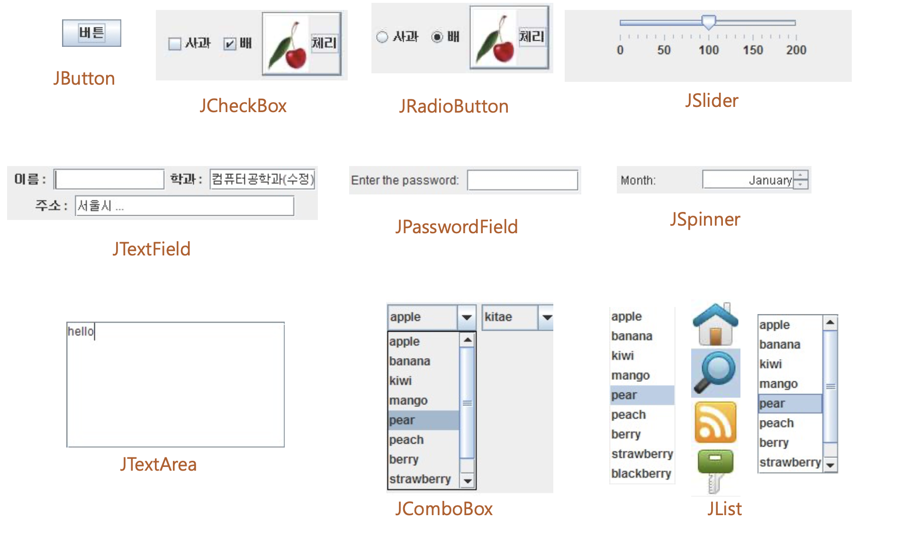
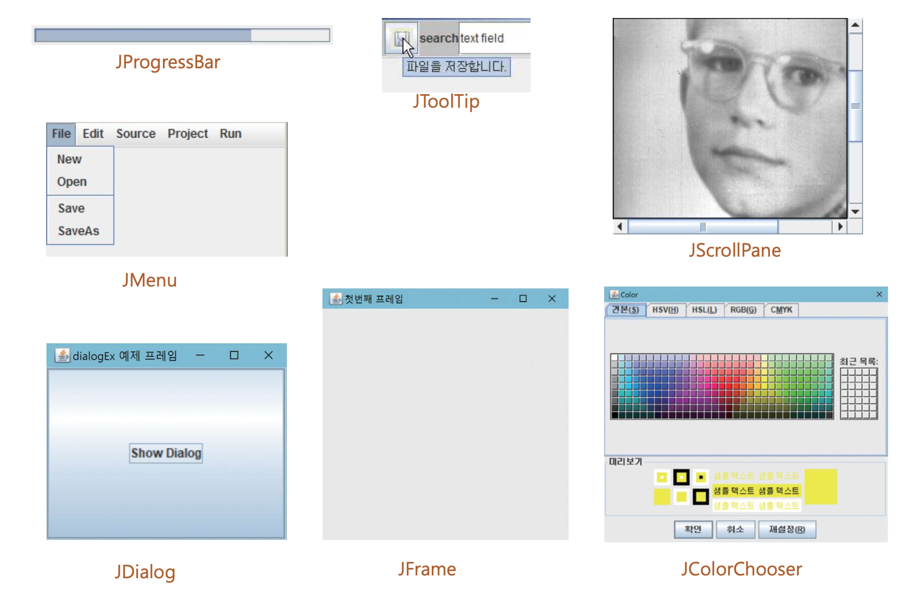
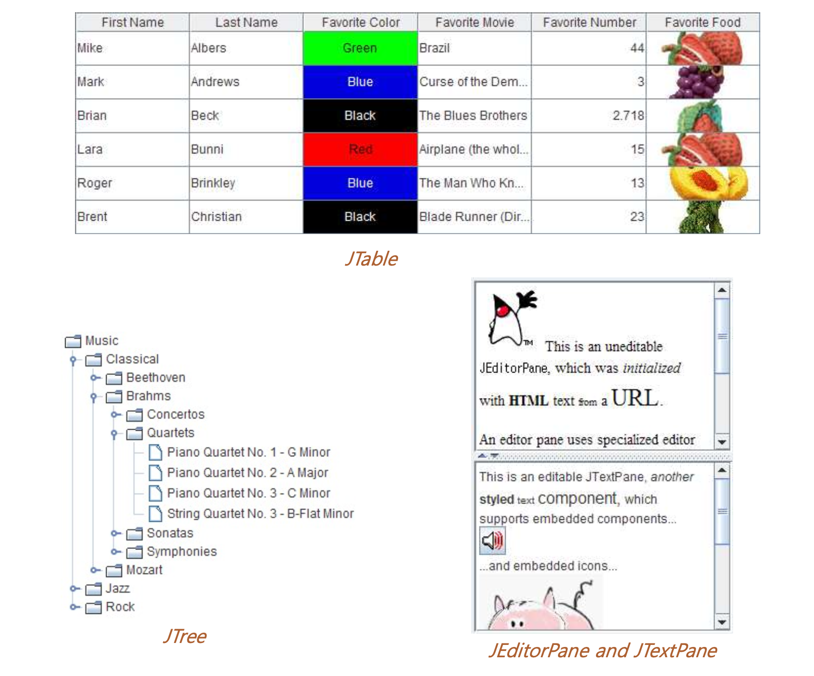
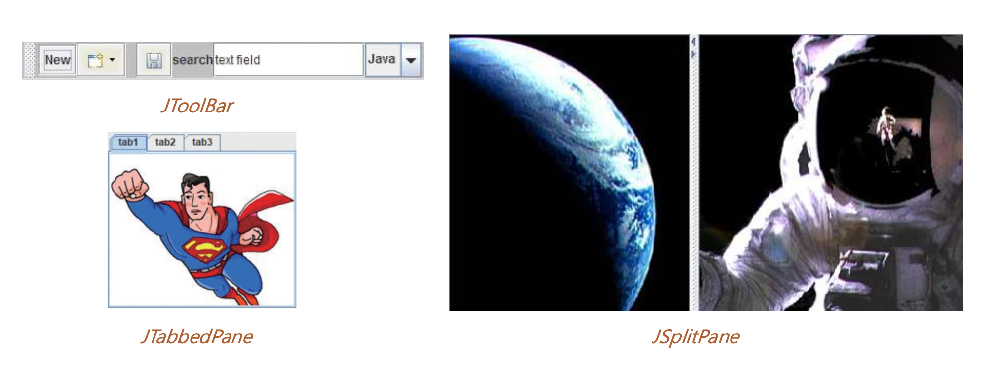
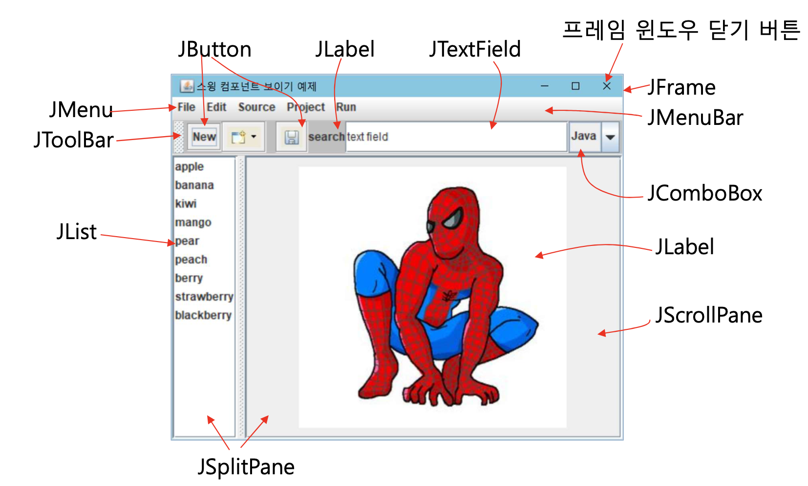
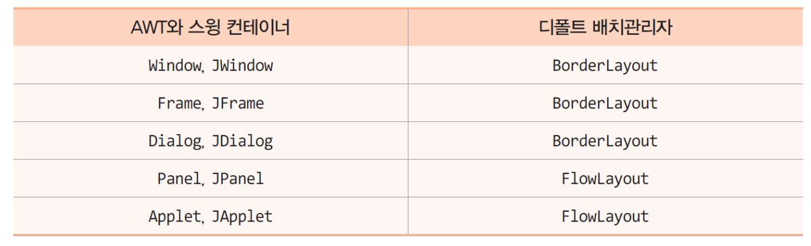
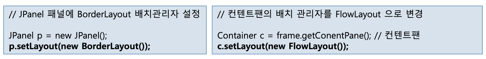

# Javax.swing
- java.awt 의 확장판
- OS에 의존하지 않음(AWT는 window용)
- AWT 컴포넌트에 J가 덧붙여진 이름의 클래스

# Swing {Containers , Components}





---




# Container에 Component 넣기.

### Frame title 삽입
```java
public MyFrame() { // 생성자
super("타이틀문자열"); // Jframe의 생성자 호출하여 타이틀 달기
setTitle("타이틀문자열"); // 메소드를 호출하여 타이틀 달기
}
```
### contentPane 호출
```java
Container contentPane = frame.getContentPane();
```
### contentPane에 Component 삽입

```java
Container c = frame.getContentPane();
JButton b = new JButton("Click");
c.add(b);
```
### contentPane 변경
```java
JPanel p = new JPanel();
frame.setContentPane(p);
```
## Swing 프로그램 종료
### 프로그램 내부 조작으로 종료하기
```java
System.exit(0); //  언제 어디서나 무조건 종료
```
### 
종료버튼(X)을 누르면 프레임이 될 뿐 응용프로그램이 종료한게 아님.
키보드나 마우스 입력을 받지 못할 뿐임

다시 setVisible(true)를 호출하면 보이게 되고 이전 처럼 작동함
 
### (X)버튼 눌러서 응용프로그램 종료 하는 방법
```java
frame.setDefaultCloseOperation(JFrame.EXIT_ON_CLOSE);
```

# Container Layout
## default Layout

## Layout 지정
```
Container.setLayout(LayoutManager lm)
```

lm을 새로운 배치관리자로 설정

